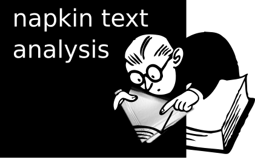

# napkin-text-analysis

Napkin is a Python tool to produce statistical analysis of a text.

Analysis features are :

- Verbs frequency
- Nouns frequency
- Digit frequency
- Labels frequency such as (Person, organisation, product, location) as defined in spacy.io [named entities](https://spacy.io/api/annotation#named-entities)
- URL frequency
- Email frequency
- Mention frequency (everything prefixed with an @ symbol)
- Out-Of-Vocabulary (OOV) word frequency meaning any words outside English dictionary

Verbs and nouns are in their lemmatized form by default but the option `--verbatim` allows to keep the original inflection.

Intermediate results are stored in a Redis database to allow the analysis of multiple text files.

# requirements

- Python >= 3.6
- spacy.io
- redis (a redis server running on port 6380 is required)
- pycld3
- tabulate

# how to use napkin

~~~~
usage: napkin.py [-h] [-v V] [-f F] [-t T] [-s] [-o O] [-l L] [--verbatim]
                 [--no-flushdb] [--binary]

Extract statistical analysis of text

optional arguments:
  -h, --help    show this help message and exit
  -v V          verbose output
  -f F          file to analyse
  -t T          maximum value for the top list (default is 100) -1 is no limit
  -s            display the overall statistics (default is False)
  -o O          output format (default is csv), json, readable
  -l L          language used for the analysis (default is en)
  --verbatim    Don't use the lemmatized form, use verbatim. (default is the
                lematized form)
  --no-flushdb  Don't flush the redisdb, useful when you want to process
                multiple files and aggregate the results. (by default the
                redis database is flushed at each run)
  --binary      Output response in binary instead of UTF-8 (default)
~~~~

# example usage of napkin

A sample file "The Prince, by Nicoló Machiavelli" is included to test napkin.

`python3 ./bin/napkin.py -o readable -f samples/the-prince.txt -t 4`

Example output:

~~~~
╒═════════════════╕
│ Top 4 of verb   │
╞═════════════════╡
│ 116 occurences  │
├─────────────────┤
│ make            │
├─────────────────┤
│ 106 occurences  │
├─────────────────┤
│ may             │
├─────────────────┤
│ 102 occurences  │
├─────────────────┤
│ would           │
╘═════════════════╛
╒═════════════════╕
│ Top 4 of noun   │
╞═════════════════╡
│ 108 occurences  │
├─────────────────┤
│ state           │
├─────────────────┤
│ 90 occurences   │
├─────────────────┤
│ people          │
├─────────────────┤
│ one             │
╘═════════════════╛
╒════════════════════╕
│ Top 4 of hashtag   │
╞════════════════════╡
╘════════════════════╛
╒════════════════════╕
│ Top 4 of mention   │
╞════════════════════╡
╘════════════════════╛
╒══════════════════╕
│   Top 4 of digit │
╞══════════════════╡
│           750175 │
├──────────────────┤
│          6221541 │
├──────────────────┤
│            57037 │
╘══════════════════╛
╒═════════════════════════════════════════╕
│ Top 4 of url                            │
╞═════════════════════════════════════════╡
│ 1 occurences                            │
├─────────────────────────────────────────┤
│ www.gutenberg.org/license               │
├─────────────────────────────────────────┤
│ www.gutenberg.org/contact               │
├─────────────────────────────────────────┤
│ http://www.gutenberg.org/5/7/0/3/57037/ │
╘═════════════════════════════════════════╛
╒════════════════╕
│ Top 4 of oov   │
╞════════════════╡
│ 6 occurences   │
├────────────────┤
│ Vitelli        │
├────────────────┤
│ Pertinax       │
├────────────────┤
│ Orsinis        │
╘════════════════╛
╒═══════════════════╕
│ Top 4 of labels   │
╞═══════════════════╡
│ 197 occurences    │
├───────────────────┤
│ CARDINAL          │
├───────────────────┤
│ 189 occurences    │
├───────────────────┤
│ ORG               │
├───────────────────┤
│ 131 occurences    │
├───────────────────┤
│ NORP              │
╘═══════════════════╛
~~~~

# what about the name?

The name 'napkin' came after a first sketch of the idea on a napkin. The goal was also to provide a simple text analysis tool which can be run on the corner of table in a kitchen.

# LICENSE

napkin is free software under the AGPLv3 license.

~~~~
Copyright (C) 2020 Alexandre Dulaunoy
Copyright (C) 2020 Pauline Bourmeau
~~~~
